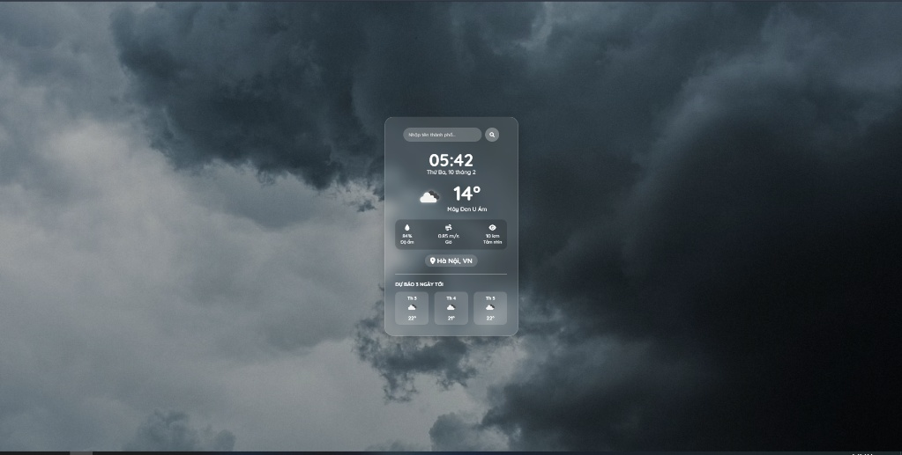

# 🌤️ Weather Pro Max - Realtime Weather App


Một ứng dụng web đơn giản nhưng hiện đại giúp theo dõi thời gian và thời tiết theo thời gian thực. Giao diện được thiết kế theo phong cách **Glassmorphism** (kính mờ) kết hợp với hiệu ứng 3D tương tác.

## 🌟 Tính năng nổi bật

* 🕒 **Đồng hồ thời gian thực:** Hiển thị giờ, ngày tháng chính xác từng giây.
* 🌦️ **Thời tiết hiện tại:** Cập nhật nhiệt độ, mô tả, độ ẩm và tốc độ gió.
* 📅 **Dự báo 3 ngày tới:** Tự động lọc dữ liệu để đưa ra dự báo ngắn hạn.
* 🎨 **Giao diện đẹp mắt:** * Hiệu ứng nền chuyển màu (Aurora Gradient).
    * Hiệu ứng kính mờ (Glassmorphism).
    * Hiệu ứng nghiêng 3D (3D Tilt) khi di chuột.
* ⚡ **Tự động cập nhật:** Dữ liệu thời tiết được làm mới mỗi 10 phút.

## 🛠️ Công nghệ sử dụng

* **HTML5 & CSS3:** Bố cục và hiệu ứng Animation.
* **JavaScript (ES6):** Xử lý logic và gọi API.
* **OpenWeatherMap API:** Nguồn dữ liệu thời tiết.
* **Vanilla-Tilt.js:** Thư viện tạo hiệu ứng nghiêng 3D.
* **FontAwesome:** Bộ icon giao diện.

## 📸 Demo



## 🚀 Cách cài đặt

1.  Clone project này về máy:
    ```bash
    git clone https://github.com/KryonBinary/weather.git
    ```
2.  Mở file `index.html` bằng trình duyệt bất kỳ.
3.  Tận hưởng!

## 📝 Lưu ý

Project sử dụng API Key miễn phí từ OpenWeatherMap. Nếu bạn clone về, hãy vào file `script.js` và thay thế bằng API Key của riêng bạn để đảm bảo ổn định.

---
Made by KryonBinary with Gemini